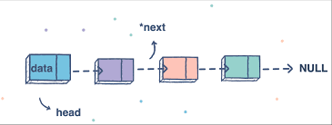

# Readings For Class05

## ***Big O Notation***
 

Big O notation is used in Computer Science to describe the performance or complexity of an algorithm. Big O specifically describes the worst-case scenario, and can be used to describe the execution time required or the space used (e.g. in memory or on disk) by an algorithm.

So basically Big O is a way of evaluating an algorithm's rate of growth, as it describes the complexity of it and the importance of studying complexity is to look out for efficiency and time as they are related.
 

And here are some functions to help wrap my head around it:
 

1. **O(1): Constant time complexity**
 

    So the execution time of these algorithms is independent of the size or space of the input data.
 

2. **O(N): Linear time complexity**
the execution time of these algorithms will grow is directly proportional to the size of the input data.
 

3. **O(N²): Quadratic time complexity**

    The execution time of these algorithms is directly proportional to the square of the size of the input data.
 

4. **O(2^N): Exponential Time complexity**

    It's when the growth doubles with each addition to the input data set.
 
 

Big O's role in algorithm efficiency is to describe the worst-case efficiency that an algorithm can attain when performing its function. It emphasizes on the Space and Time. In order to investigate these limiting variables, There are 4 other areas to consider:

1. Size of the input

2. Measurement Systems

3. Growth Sequences

4. Best-case scenario, worst-case scenario, and average-case scenario

 

## ***Linked Lists***

data structure,, are the various ways in which we can organize our data and include variables, arrays, hashes, and objects. One of the more complex data strucures are linked lists; 

~~ what type of data structure are the linked lists?
linked lists are linear data structures which mean that they are produced and traversed in a specific order. And that in order to reach to the end of the list, we must go through all of the items sequentially. Non-linear structures, on the other hand, are the total opposite of linear structures. Items in non-linear data structures do not have to be organized in any particular order.

 

**Arrays and Linked lists:**

When it comes to data sequences, arrays and linked lists are similar. As order is important in both of these structures. But there's also some differences when it comes to ***Memory management*** ---> The way arrays and linked lists use memory on our devices is the most significant difference between them.
Despite the fact that there are numerous layers of abstraction, we don't have to think about memory allocation at all.
But that doesn't eliminate the possibility of memory allocation! Abstraction isn't magic; it's basically the process of concealing items that you don't need to deal with on a regular basis. Even if we don't have to care about memory allocation when writing code, we need to get down to the elementary level if we want to properly understand what's going on in a linked list and what makes it so strong. 

The major distinction between arrays and linked lists is that arrays are static data structures, while linked lists are dynamic. A static data structure demands all of its resources allocated at the time of creation; this means that even if the structure grows or shrinks in size, and elements are added or removed, it will always demand the same size and memory. If more elements were needed to be added to a static data structure but it didn't have enough memory, you'd have to copy the contents of that array, and recreate it with more memory.
A dynamic data structure, on the other hand, can shrink.

 

 

**Parts of a linked list**

The list's starting point is a pointer to the first node, which is called the **head**. Almost all linked lists must have a **head**, because it is the list's and all of its elements' single entry point, because without it, you wouldn't know where to begin! The node at the end of the list is a node that points to **null**, or an empty value. As can be seen in the picture below:

**Linked Lists types**

~~ **Singly Linked List**

It's a unidirectional linked list. So, you can only traverse it in one direction, from head node to tail node.

~~ **Doubly Linked List**

It's a bi-directional linked list. So, you can traverse it in both directions. Unlike singly linked lists, its nodes contain one extra pointer called the previous pointer. This pointer points to the previous node.

~~ **Circular Linked List**

It's a unidirectional linked list. So, you can traverse it in only one direction. But this type of linked list has its last node pointing to the head node. So while traversing, you need to be careful and stop traversing when you revisit the head node.

 
