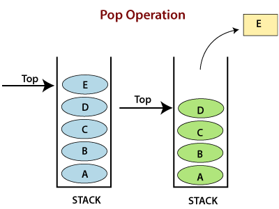
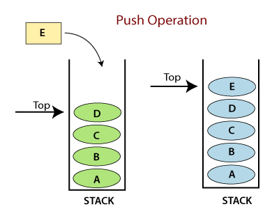

# **Implementation: Stacks and Queues**

## **Stack**
A **stack** is a data structure that consists of Nodes. Each Node only references the next Node in the stack and not the ond before it.

~ What can be doen on a stack is:

- Push: To add nodes or items into the stack

- Pop: To remove nodes or items from the stack. When attempting to pop an empty stack an exception will be raised.

- Top: This is the top of the stack.

- Peek: To view the top node of the stack. When attempting to peek an empty stack an exception will be raised.

- IsEmpty: A methid that returns true when stack is empty otherwise returns false.

 

~ Concepts for handling stacks:

- **FILO: First In Last Out**
This means that the first item added in the stack will be the last item popped out of the stack.

- **LIFO: Last In First Out**
This means that the last item added to the stack will be the first item popped out of the stack.

 

~ Stack Visualization:

The topmost item is the **top**. When you **push** something to the stack, it becomes the new top. When you **pop** something from the stack, you pop the current top and set the next top as **top.next**.

 

~ The pop method: 

To remove or pop a node off the stack we are removing it from the top. So the top node will be re-assigned to the node that lives below and the top node is returned to the user.

 

~ The push method: 

To add or push a node into the stack, I would assign it as the new top, with its next pointing to the original top.

 

~ The peek method:

This method is for inspecting the top node of the stack.

 

~ The isEmpty method:

This method returns a True or False, based on the existance of a top node or not. (empty stack or not).

 

 

## **Queue**

~ What can be doen on a queue:

- Enqueue: To add nodes or items to the queue.
- Dequeue: To remove items or nodes from the queue. And if the queue is empty an exception will be raised.
- Front: This is the front/first node of the queue.
- Rear: This is the rear/last node of the queue.
- Peek: To view the value of the front node in the queue. And if the queue is empty an exception will be raised.
- IsEmpty: A method that returns true when queue is empty otherwise returns false.

 

~  Concepts for handling queues:

- **FIFO: First In First Out**
This means that the first item in the queue will be the first item out of the queue.

- **LILO: Last In Last Out**
This means that the last item in the queue will be the last item out of the queue.

 

~ Queue Visualization:

 

~ The enqueue method:

1. Change the next property of the **rear node** to point to the node we are adding.

2. Re-assign the **rear** reference or pointer to point to the node we are adding.

 

~ The dequeue method:

1. Create a temporary reference named **temp** and have it point to the same node that **front** is pointing too.

2. Re-assign **front** to the next value that the node front is pointing to.

3. Re-assign the next property on the **temp** node to None. 

 

~ The peek method:

This method is for inspecting the front node of the queue.

 

~ The isEmpty method:

This method returns a True or False, based on the existance of a top node or not. (empty queue or not).