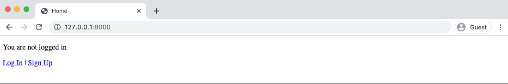
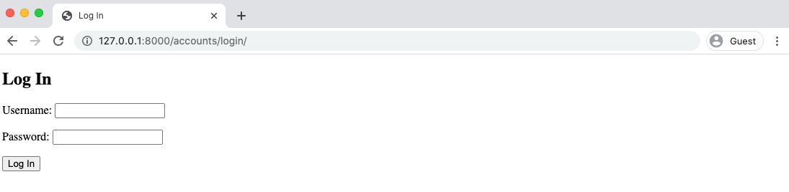

# **Readings: Django Custom User**

ALthough Django comes with a built-in User model for authentication, the official Django documentation strongly advises utilizing a custom user model in a real-world project. As a general guideline, adopt a custom user model for all new Django projects because it allows significantly greater flexibility down the road.

But how to implement one? 

1. create and navigate into a dedicated directory called *accounts*
2. install Django
3. make a new Django project called *django_project*
4. make a new app *accounts*
5. start the local web server

Here are the commands to run:
```
> cd onedrive\desktop\code
> mkdir pages
> cd pages
> python -m venv .venv
> .venv\Scripts\Activate.ps1
(.venv) > python -m pip install django~=4.0.0
(.venv) > django-admin startproject django_project .
(.venv) > python manage.py startapp accounts
(.venv) > python manage.py runserver
```

### **Note:**
We did not run ```migrate``` to configure our database. It's important to wait until after we've created our new custom user model before doing so.

<br>

<br>

## **Modern Ways to Create Custom User in Django**: *AbstractUser vs AbstractBaseUser*

*AbstractUser* actually subclasses *AbstractBaseUser* but provides more default configuration.

<br>


### **Creating our initial custom user model requires four steps:**

1. Update ``django_project/settings.py``:

    Within **INSTALLED_APPS** add ``accounts`` at the bottom. Then at the bottom of the entire file, add the **AUTH_USER_MODEL** config to tell Django to use our new custom user model (CustomUser) in place of the built-in User model.

    ```
    INSTALLED_APPS = [
        "django.contrib.admin",
        "django.contrib.auth",
        "django.contrib.contenttypes",
        "django.contrib.sessions",
        "django.contrib.messages",
        "django.contrib.staticfiles",
        "accounts",  # new
    ]
    ...
    AUTH_USER_MODEL = "accounts.CustomUser"  # new
    ```


2. Create a new ``CustomUser model``

    ```
    from django.contrib.auth.models import AbstractUser
    from django.db import models

    class CustomUser(AbstractUser):
        pass
        # add additional fields in here

        def __str__(self):
            return self.username
    ```


3. Create new ``UserCreation`` and ``UserChangeForm``

    Stop the local server with *Control+c* and create a new file in the ``accounts`` app called *forms.py* and add the following:

    ```
    from django import forms
    from django.contrib.auth.forms import UserCreationForm, UserChangeForm

    from .models import CustomUser

    class CustomUserCreationForm(UserCreationForm):

        class Meta:
            model = CustomUser
            fields = ("username", "email")

    class CustomUserChangeForm(UserChangeForm):

        class Meta:
            model = CustomUser
            fields = ("username", "email")
    ```

4. Update the *admin*

    ```
    from django.contrib import admin
    from django.contrib.auth.admin import UserAdmin

    from .forms import CustomUserCreationForm, CustomUserChangeForm
    from .models import CustomUser

    class CustomUserAdmin(UserAdmin):
        add_form = CustomUserCreationForm
        form = CustomUserChangeForm
        model = CustomUser
        list_display = ["email", "username",]

    admin.site.register(CustomUser, CustomUserAdmin)
    ```
5. Run ``makemigrations`` and ``migrate`` for the first time to create a new database that uses the custom user model.
    ```
    (.venv) > python manage.py makemigrations accounts
    (.venv) > python manage.py migrate
    ```

<br>

## **Superuser**

Create a superuser that we can use to log in to the admin and test out log in/log out.
```
(.venv) > python manage.py createsuperuser
```

<br>

## **Templates/Views/URLs**

1. Update *settings.py* to use a project-level templates directory.
    ```
    TEMPLATES = [
        {
            ...
            "DIRS": [BASE_DIR / "templates"],  # new
            ...
        },
    ]
    ```
2. Set the redirect links for log in and log out, which will both go to our *home* template.

    ```
    LOGIN_REDIRECT_URL = "home"
    LOGOUT_REDIRECT_URL = "home"
    ```

3. Create a new project-level templates folder and within it a *registration* folder as that's where Django will look for the log in template. We will also put our *signup.html* template in there.

    ```
    mkdir templates/registration
    ```
4. Then create four templates:
    - *login.html*
    - *signup.html*
    - *base.html*
    - *home.html*

5. Update the templates

6. Update *urls.py* to include the new *registration* URL patterns.

    ```
    from django.contrib import admin
    from django.urls import path, include
    from django.views.generic.base import TemplateView


   urlpatterns = [
    path("", TemplateView.as_view(template_name="home.html"), name="home"),
    path("admin/", admin.site.urls),
    path("accounts/", include("accounts.urls")),
    path("accounts/", include("django.contrib.auth.urls")),
]
    ```
7. Create a *urls.py* file in the ``accounts`` app

    ```
    from django.urls import path
    from .views import SignUpView

    urlpatterns = [
        path("signup/", SignUpView.as_view(), name="signup"),
    ]
    ```

8. Last step is our *views.py* file in the ``accounts`` app which will contain our signup form.

    ```
    from django.urls import reverse_lazy
    from django.views.generic.edit import CreateView

    from .forms import CustomUserCreationForm

    class SignUpView(CreateView):
        form_class = CustomUserCreationForm
        success_url = reverse_lazy("login")
        template_name = "registration/signup.html"
    ```

9. Now we're done! Start up the server with ```python manage.py runserver``` and go to the *home* page.

10. Click on Log In and use your superuser credentials.






