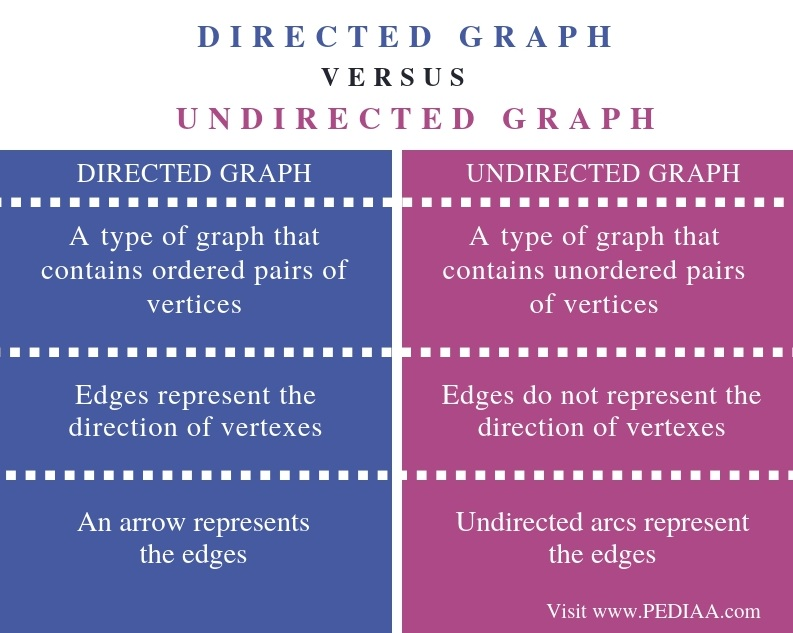

# **Implementation: Graphs**

A graph is a non-linear data structure that can be looked at as a collection of vertices (or nodes) potentially connected by line segments named edges.

## **Terminology:**

1. **Vertex:** A vertex, also called a “node”, is a data object that can have zero or more adjacent vertices.


2. **Edge:** An edge is a connection between two nodes.


3. **Neighbor:** The neighbors of a node are its adjacent nodes, i.e., are connected via an edge.


4. **Degree** The degree of a vertex is the number of edges connected to that vertex.


<br>

## **Directed vs Undirected**

### **Undirected Graphs**

An Undirected Graph is a graph where each edge is undirected or bi-directional. This means that the undirected graph does not move in any direction.


Above is an undirected graph. There is no direction in any of the edges. It is possible to traverse from 2 to 3, 3 to 2, 1 to 3, 3 to 1 etc.

- **Set of vertices (V):** {1, 2, 3, 4}

- **Set of edges (E):** {(1, 2), (2, 1), (2, 3), (3, 2), (1, 3), (3, 1), (3, 4), (4, 3)}

<br>

### **Directed Graphs**


A Directed Graph is a graph where each edge is directed. This means that the graph moves in one direction. Also called a ***Digraph*** 


- **Set of vertices (V):** {A, B, C, D, E, F}

- **Set of edges (E):**  {(A,B),(B,C),(C,E),(E,D),(D,E),(E,F)}

<br>


### **Difference Between Directed and Undirected Graph**




<br>

<br>


## **Complete vs Connected vs Disconnected**


There are many different types of graphs. This depends on how connected the graphs are to other node/vertices.

- ### **Complete Graphs**

    A complete graph is a graph where all the vertices are connected to all the other vertices.

<br>

- ### **Connected Graphs**

    A connected graph is graph that has all of vertices/nodes have at least one edge.

<br>

- ### **Disconnected Graphs**

    A disconnected graph is a graph where some vertices may not have edges.


<br>

<br>


## **Traversals**

You will be required to traverse through a graph. The traversals itself are like those of trees. Below is a breakdown of how you would traverse a graph.

<br>

## **Breadth First**

Breadth first traversal is when you visit all the nodes that are closest to the root as possible. From there you traverse outwards, level by level, until you have visited all the vertices/nodes.


### **Algorithm breadth first traversal looks like:**

- Enqueue the declared start node into the Queue.
- Create a loop that will run while the node still has nodes present.
-  the first node from the queue
- if the Dequeue‘d node has unvisited child nodes, add the unvisited children to visited set and insert them into the queue.


<br>

## **Pseudocode For Breadth First Traversal:**

```
ALGORITHM BreadthFirst(vertex)
    DECLARE nodes <-- new List()
    DECLARE breadth <-- new Queue()
    DECLARE visited <-- new Set()

    breadth.Enqueue(vertex)
    visited.Add(vertex)

    while (breadth is not empty)
        DECLARE front <-- breadth.Dequeue()
        nodes.Add(front)

        for each child in front.Children
            if(child is not visited)
                visited.Add(child)
                breadth.Enqueue(child)

    return nodes;
```

<br>

## **Depth First**

In a depth first traversal while the breadth first traversal uses a Queue to visit all children at a given level, the depth first traversal uses a Stack to visit all children of a given subtree. 


### **The algorithm for a depth first traversal:**

- Push the root node into the Stack and mark as visited.
- Start a while loop that runs as long as the stack is not empty.
- Pop the top node off of the stack and check its neighbors.
- If a neighbor hasn’t been visited, push it onto the stack and mark as visited.
- Repeat until the stack is empty.


<br>

### **Procedure for Depth First Traversal:**


1. We start by adding our root Node (Node A) to the Stack and marking it as visited.

2. Initiate our loop and begin Popping Nodes off the Stack.

3. We pop off our root Node and check its neighbors, as neither have been visited. We then push both Node B and Node D onto the Stack and mark them as visited.

4. At this points, depending on the order in which Nodes B and D have been added as neighbors, we assume that Node B is the top Node ready to Pop off and be evaluated.

5. We pop off Node B and check its neighbors: Node C, which has not been visited so we add it to the top of the Stack and mark as visited.


6. As our Stack is not empty, we continue to Pop nodes from the top of our stack, by the time we hit Node G this is the state of our data structure:


7. Now that we have visited all the neighbors of one sub child, the top of our stack contains Node D, the other neighbor of our root node.


8. From here, pop off Node D and check it’s neighbors to add them to our Stack.


9. Again, depending on the order in which these Nodes were added as neighbors to Node D, we should check Nodes A, B, E, H, and F, and we should note that both Node A and Node B have been visited, leaving Nodes E, H, and F as nodes to be Pushed onto the Stack:


10. With Node E sitting at the top of the Stack, we pop it off the Stack and check it’s neighbors. There is only one, Node D.


11. Since Node D has already been visited, we can ignore it and Pop the next node off the Stack: Node H.


12. We check the neighbors for Node H and notice that both Nodes D and F have previously been visited, so neither are added to the Stack.


13. Finally we Pop off Node F, and again notice that both neighbors Node D and Node H have already been visited, so we don’t add anything to our Stack.


14. We have now completed our traversal with all nodes read in Depth First Order!

