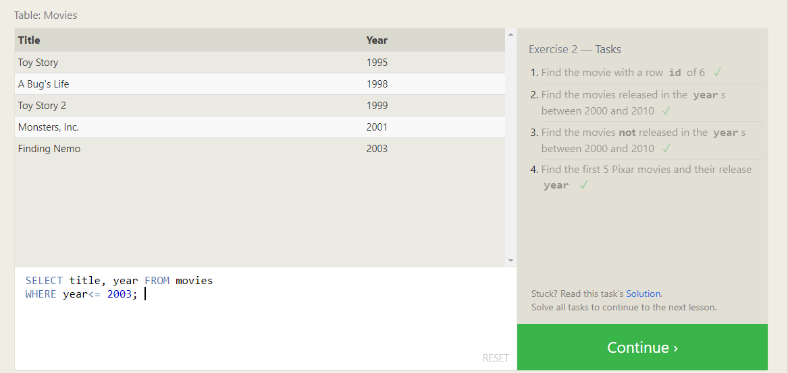
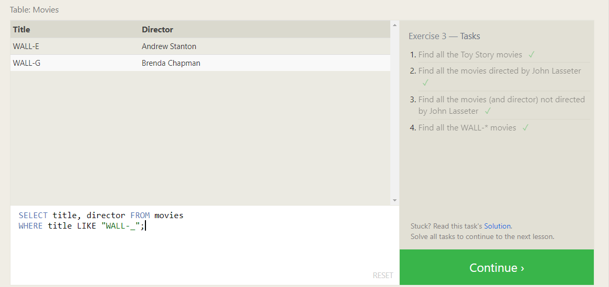
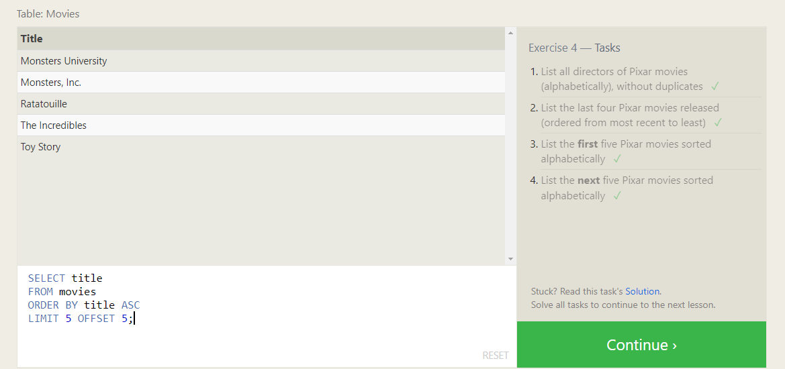
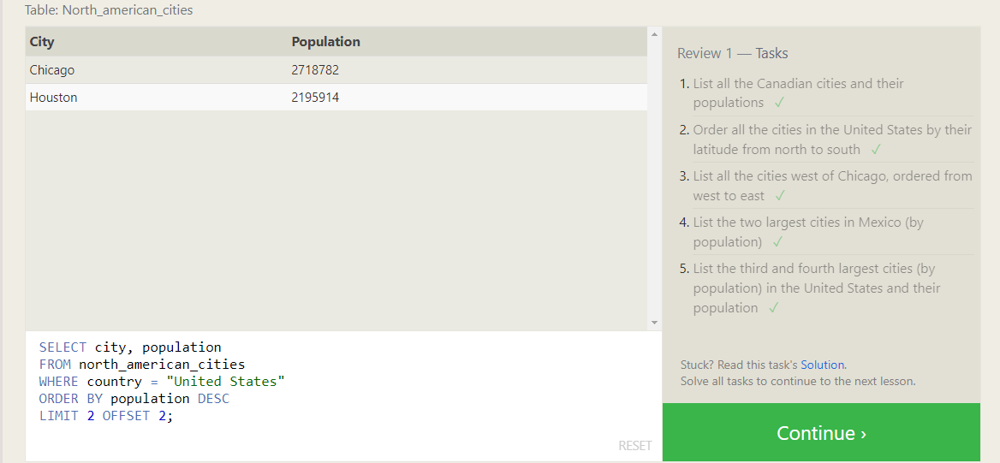
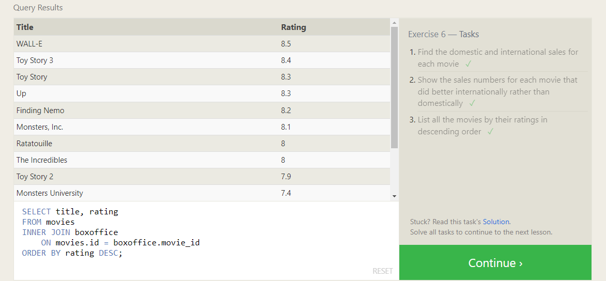

# Introduction to SQL

> ### Explaning my understanding of SQL and relational databases.


## Firstly, what is meant by SQL?
*(Structured Query Language)*

It's a language that's simple enough to allow both experienced and non expereienced technicals to access, manipulate and do other operations to the data from a relational database.
Plus, SQL has many other databases that support the common standard for the language while also having additional features and storage type that differentiate them from one another and these databases are:
- SQLite
- MySQL
- Postgres
- Oracle
- Microsoft SQL Server


## What is meant by relational database?

Basically this database represents a collection of related -hence the name relational- tables, and those tables are made up of rows and coloumns data, and each one of them answers a specific question relating to the big table.

Now let's head down to the lessons and exercises:
 
>## SQL Lesson 1: SELECT queries 101

*In this lesson I was introduced to a query method of SELECT, that's used to retrieve column's data from a SQL database.*

The syntax goes like this:
```
SELECT column's_name
FROM table's_name;
```
But if I wanted to retrieve all the data in the table, I would use the asterisk (*), like this:
```
SELECT *
FROM table's_name;
```
### **Lesson 1 Exercise**


>## SQL Lesson 2: Queries with constraints (Pt. 1)

*To avoid getting all the data when retrieving a certain column in a database table, I can use a WHERE, which will help me filter out unneccessary information and only get me the ones that I requested*.
*This also allows the query to run faster due to the reduction in unnecessary data being returned.*

*I can also use logical keywords, such as: AND/OR and other numeric operators, such as:*

| Operator | Condition |
| ----------- | ----------- |
| =, !=, < <=, >, >= | Standard numerical operators	 |
| BETWEEN … AND …	 | Number is within range of two values (inclusive)	 |
| NOT BETWEEN … AND …	 | Number is not within range of two values (inclusive)		 |
| IN (…)		 | Number exists in a list |
| NOT IN (…)	| Number does not exist in a list |


The syntax goes like this:
```
SELECT column's_name
FROM table's_name
WHERE condition
    AND/OR another_condition
    AND/OR …;
```
### **Lesson 2 Exercise**



>## SQL Lesson 3: Queries with constraints (Pt. 2)
*I can filter the text data inside the columns of a table by using operators provided by SQL, and they allow me to do some comparison and matching, amongst other things.*

*And these are the operators:*
| Operator | Condition |
| ----------- | ----------- |
| = | Case sensitive exact string comparison |
| != or <> | Case sensitive exact string inequality comparison |
| LIKE | Case insensitive exact string comparison	 |
| NOT LIKE	 | Case insensitive exact string inequality comparison	 |
| % | Used anywhere in a string to match a sequence of zero or more characters (only with LIKE or NOT LIKE)	 |
| _ | Used anywhere in a string to match a single character (only with LIKE or NOT LIKE)	 |
| IN (…) | String exists in a list	 |
| NOT IN (…) | String does not exist in a list	 |

### **Lesson 3 Exercise**



>## SQL Lesson 4: Filtering and sorting Query results
There are more than one clause or keyword to insure that the data we get from the table is filtered out, and those are:

- ### DISTINCT
*To make sure we don't get any duplicated data when aquiring data from the table, we can use the DISTINCT keyword, which makes sure of that by discarding rows that contain duplicate column values.*

The syntax goes like this:
```
SELECT DISTINCT column's_name
FROM table's_name
WHERE condition(s);
```

- ### ORDER BY 
*Because sometimes the data tables contain thousands or million rows, making it difficult to read through them neatly, SQL has a keyword specifically to help out with that; it's ORDER BY which sorts out the results in ascending or descending, avoiding all the misunderstanding that happens when reading from a data table.*

The syntax goes like this:
```
SELECT column's_name
FROM table's_name
WHERE condition(s)
ORDER BY column ASC/DESC;
```

- ## LIMIT and OFFSET
*To make clear which subset of the requested is what we really care about, we use LIMIT and OFFSET clauses, which in turn make sure to reduce the number of rows that are returned and from where exactly to begin extracting those rows, respectively.*

The syntax goes like this:
```
SELECT column's_name
FROM table's_name
WHERE condition(s)
ORDER BY column ASC/DESC
LIMIT num_limit OFFSET num_offset;
```
### **Lesson 4 Exercise**



>## SQL Lesson 5: SQL Review: Simple SELECT Queries

### **Lesson 5 Exercise**



>## SQL Lesson 6: Multi-table queries with JOINs
*In the real world entity data aren't just stored in one table, but rather spread out into mulitple tables, and that makes it difficult to gather all the needed data using only the previous clauses. That's why there are methods to deal with Multi-table queries.

- ## ***Database normalization***
*It's a design technique that reduces data redundancy and eliminates undesirable characteristics like Insertion, Update and Deletion Anomalies. Normalization rules divides larger tables into smaller tables and links them using relationships. The purpose of Normalisation in SQL is to eliminate redundant (repetitive) data and ensure data is stored logically* 
taken from:link حطي هون لينك 
https://www.guru99.com/database-normalization.html


- ## INNER JOIN.
*It helps to connect or match specific row's data from a certain table with another table, given that both of these tables share different information about one single entity. Keeping in mind that there should be a primary/unique key that both of these tables share.*


The syntax goes like this:
```
SELECT column's_name
FROM table's_name
INNER JOIN another_table 
    ON table's_name.id = another_table.id
WHERE condition(s)
ORDER BY column, … ASC/DESC
```

### **Lesson 6 Exercise**


