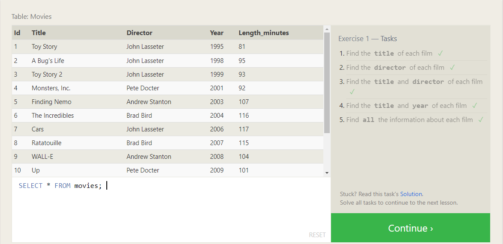

# Introduction to SQL

> ### Explaning my understanding of SQL and relational databases.


## Firstly, what is meant by SQL?
*(Structured Query Language)*

It's a language that's simple enough to allow both experienced and non expereienced technicals to access, manipulate and do other operations to the data from a relational database.
Plus, SQL has many other databases that support the common standard for the language while also having additional features and storage type that differentiate them from one another and these databases are:
- SQLite
- MySQL
- Postgres
- Oracle
- Microsoft SQL Server


## What is meant by relational database?

Basically this database represents a collection of related -hence the name relational- tables, and those tables are made up of rows and coloumns data, and each one of them answers a specific question relating to the big table.

Now let's head down to the lessons and exercises:
 
>## SQL Lesson 1: SELECT queries 101

*In this lesson I was introduced to a query method of SELECT, that's used to retrieve data from a SQL database*

The syntax goes like this:
```
SELECT column's_name
FROM table's_name;
```
But if I wanted to retrieve all the data in the table, I would use the asterisk (*), like this:
```
SELECT *
FROM table's_name;
```
### ***Lesson 1 Exercise***



